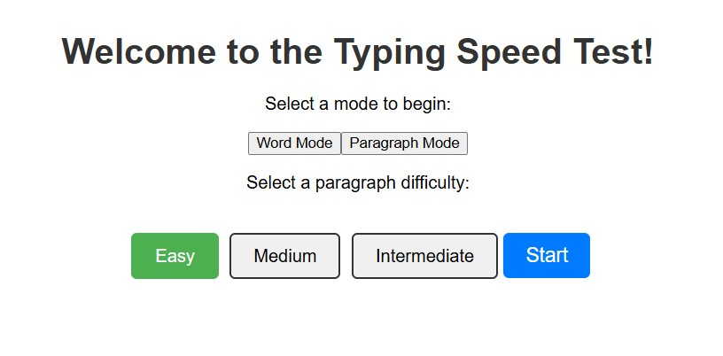
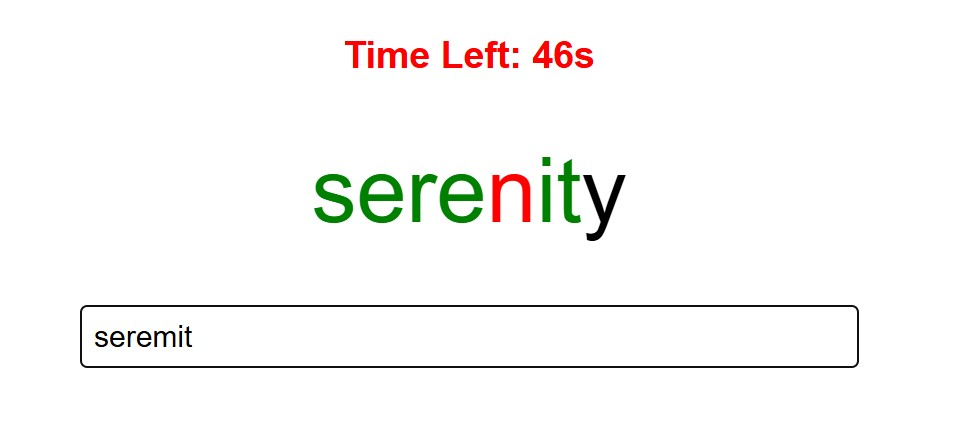
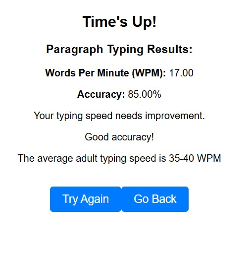

# ⌨️ Typing Speed Trainer

**Practice your typing muscle memory in two exciting modes — Word Shootout 💥 or Paragraph Challenge 📝!**

Sharpen your reflexes, boost your WPM, and track your progress as you type your way to mastery.

---

## 🚀 Overview

Test and improve your typing speed in two unique modes:

### 🎯 **Word Mode**
- Focuses on **muscle memory** and precision.  
- Type one word at a time press **space** to move on, just like typing a sentence.  
- You **can’t move to the next word** until the current one is perfectly typed.  
- Great for short, focused practice sessions.  

### 🧾 **Paragraph Mode**
- Type full sentences for a more **realistic typing experience**.  
- Measures your **overall typing speed and accuracy**.  
- Perfect for a full test of your endurance and rhythm.  
- Gives you an **accurate WPM (Words Per Minute)** score.  

> 💡 *Fun fact:* The average typing speed is **40 WPM** — can you beat it?

---

## 🧭 User Guide

1. **Select a difficulty** level for either **Word** or **Paragraph** mode.  
2. In **Word Mode**, type each word correctly and press **space** to move on.  
3. In **Paragraph Mode**, type what you see as fast and accurately as you can.  
4. Check your final **WPM** and **accuracy** score when you finish.  

---

## 🖼️ Screenshots

  

  

---

## ⚡ Tech Stack

- **React.js** ⚛️  
- **JavaScript (ES6+)**  
- **CSS / Tailwind CSS** 🎨  

---

## 💬 About

A creative and minimal typing speed app designed to make practice engaging and effective whether you want to train your reflexes or test your accuracy over time.  

Made for a university project. Feel free to edit and improve on this code as you see fit.

